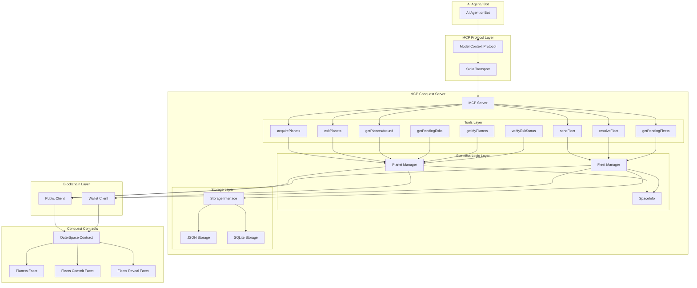
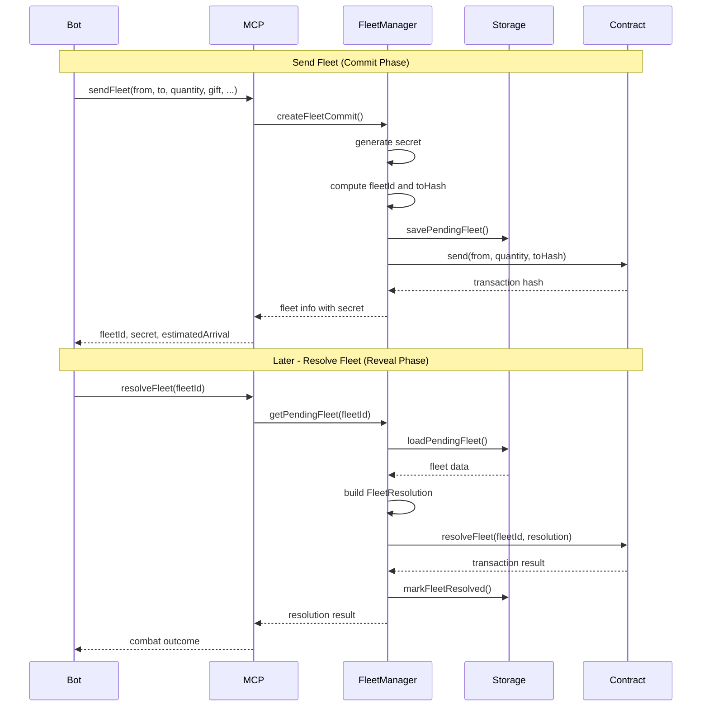

# MCP Conquest.eth Server - Architecture & Implementation Plan

## Quick Start / Context Restoration

**Purpose**: This section helps restore context in a new conversation.

**Project Status**: Architecture design complete, ready to begin Phase 1 implementation.

**Current State**:
- Repository: `mcp-conquest-eth-v0`
- Existing files: [`src/index.ts`](../src/index.ts:1), [`src/cli.ts`](../src/cli.ts:1), [`src/types.ts`](../src/types.ts:1) (empty)
- Package: MCP server skeleton with viem and mcp-ethereum integration
- Conquest contracts library: Available at `../conquest-eth-v0-contracts/js`

**Next Immediate Steps** (Phase 1: Core Infrastructure):
1. Create storage interface in [`src/storage/interface.ts`](src/storage/interface.ts:1)
2. Create JSON storage implementation in [`src/storage/json-storage.ts`](src/storage/json-storage.ts:1)
3. Create SpaceInfo wrapper in [`src/contracts/space-info.ts`](src/contracts/space-info.ts:1)
4. Create contract client setup in [`src/contracts/clients.ts`](src/contracts/clients.ts:1)
5. Update `package.json` to include local dependency: `"conquest-eth-v0-contracts": "workspace:*"`

**Key Design Decisions Made**:
- Use abstract storage interface (JSON first, SQLite optional later)
- Track both pending fleets AND pending exits
- Use batch contract functions: `acquireMultipleViaNativeTokenAndStakingToken`, `exitMultipleFor`
- No The Graph dependency - query contracts directly
- `getMyPlanets` uses center+radius search (future: maintain player index)

**9 MCP Tools to Implement**:
1. [`acquirePlanets`](#tool-1-acquireplanets) - Batch acquire planets
2. [`sendFleet`](#tool-2-sendfleet) - Commit fleet movement
3. [`resolveFleet`](#tool-3-resolvefleet) - Reveal fleet (resolve combat)
4. [`exitPlanets`](#tool-4-exitplanets) - Batch exit planets
5. [`getPendingExits`](#tool-5-getpendingexits) - Query pending exits
6. [`verifyExitStatus`](#tool-6-verifyexitstatus) - Check if exit interrupted
7. [`getMyPlanets`](#tool-7-getmyplanets) - Get owned planets in radius
8. [`getPlanetsAround`](#tool-8-getplanetsaround) - Get planets in radius
9. [`getPendingFleets`](#tool-9-getpendingfleets) - Query pending fleets

**Contract Dependencies** (local package):
- Use contracts library from [`conquest-eth-v0-contracts/js`](../conquest-eth-v0-contracts/js/index.ts:1)
- This is a local package that will be published to npm later
- Feel free to add code to this package, but keep it self-sufficient
- Key exports: `SpaceInfo`, `PlanetInfo`, `PlanetLocation`, `location utilities`
- Key contract functions: `send`, `resolveFleet`, `acquireMultipleViaNativeTokenAndStakingToken`, `exitMultipleFor`
- Query functions: `getPlanet`, `getUpdatedPlanetState`, `getFleetData`

---

## Overview

This document outlines the architecture and implementation plan for an MCP (Model Context Protocol) server that provides tools for interacting with the Conquest.eth blockchain game. The server enables AI agents and bots to play Conquest by exposing game actions as MCP tools.

## Table of Contents

1. [System Overview](#system-overview)
2. [Core Concepts](#core-concepts)
3. [Architecture Design](#architecture-design)
4. [Storage Layer](#storage-layer)
5. [MCP Tools](#mcp-tools)
6. [Implementation Plan](#implementation-plan)
7. [File Structure](#file-structure)
8. [Testing Strategy](#testing-strategy)

---

## System Overview

The MCP Conquest.eth server acts as a bridge between AI agents and the Conquest.eth smart contracts. It provides:

- **Game Actions**: Tools for commit-reveal mechanics (send fleets, resolve fleets)
- **Planet Management**: Tools for acquiring, exiting, and monitoring planets
- **Query Operations**: Tools for fetching game state (planets, fleets, exits)
- **Persistence**: Abstract storage for tracking pending fleets and exits

### Key Design Principles

1. **Storage Abstraction**: Pending fleet and exit data storage is abstracted to allow easy switching between JSON, SQLite, or other storage mechanisms
2. **Exit Tracking**: Track pending exits and detect interruptions from attacks
3. **Direct Contract Queries**: No dependency on The Graph - all data fetched directly from smart contracts
4. **Commit-Reveal Support**: Full support for the game's commit-reveal mechanism with fleet tracking
5. **Type Safety**: Full TypeScript integration with viem for blockchain interactions

---

## Core Concepts

### Conquest Game Mechanics

#### Commit-Reveal Pattern
Conquest uses a commit-reveal pattern for fleet movements to prevent front-running:

1. **Commit Phase**: Player commits a hash of fleet details (secret, destination, quantity, etc.)
2. **Travel Phase**: Fleet travels for hours/days based on distance
3. **Reveal Phase**: Player reveals the actual fleet details using the secret
4. **Resolution**: Combat occurs, planet ownership may change

#### Fleet Data Structure

```typescript
// Fleet commit data (stored for later reveal)
interface PendingFleet {
  fleetId: string;           // Computed from toHash, from, fleetSender, operator
  fromPlanetId: bigint;      // Source planet location
  toPlanetId: bigint;        // Destination planet location (hidden during commit)
  quantity: number;          // Number of spaceships
  secret: `0x${string}`;     // Random secret for hash commitment
  gift: boolean;             // Whether this is a gift (no combat)
  specific: `0x${string}`;   // Specific target address (advanced feature)
  arrivalTimeWanted: bigint; // Preferred arrival time (advanced feature)
  fleetSender: `0x${string}`; // Address that sent the fleet
  operator: `0x${string}`;   // Address that committed the transaction
  committedAt: number;       // Timestamp of commit transaction
  estimatedArrivalTime: number; // Estimated arrival time
  resolved: boolean;         // Whether fleet has been revealed/resolved
  resolvedAt?: number;       // Timestamp of resolution
}

// Pending exit data (tracked for status monitoring)
interface PendingExit {
  planetId: bigint;          // Planet location ID
  player: `0x${string}`;     // Player who initiated the exit
  exitStartTime: number;     // Timestamp when exit was initiated
  exitDuration: number;      // Duration of exit process (typically 7 days)
  exitCompleteTime: number;  // When exit will complete
  numSpaceships: number;     // Spaceships on planet at exit start
  owner: `0x${string}`;      // Current owner (may change due to attacks)
  completed: boolean;        // Whether exit has completed
  interrupted: boolean;      // Whether exit was interrupted by attack
  lastCheckedAt: number;     // Last time status was verified against contract
}

// Fleet resolution data
interface FleetResolution {
  from: bigint;              // Source planet location
  to: bigint;                // Destination planet location
  distance: bigint;          // Distance between planets
  arrivalTimeWanted: bigint; // Preferred arrival time
  gift: boolean;             // Whether this is a gift
  specific: `0x${string}`;   // Specific target address
  secret: `0x${string}`;     // The secret used to generate the hash
  fleetSender: `0x${string}`; // Address that sent the fleet
  operator: `0x${string}`;   // Address that committed the transaction
}
```

#### Planet Data Structure

```typescript
// Planet static info (from SpaceInfo class)
interface PlanetInfo {
  location: {
    id: bigint;
    x: number;
    y: number;
    globalX: number;
    globalY: number;
  };
  type: number;
  stats: {
    name: string;
    stake: number;
    production: number;
    attack: number;
    defense: number;
    speed: number;
    natives: number;
    subX: number;
    subY: number;
    cap: number;
    maxTravelingUpkeep: number;
  };
}

// Planet dynamic state (from contract)
interface ExternalPlanet {
  owner: string;
  ownershipStartTime: number;
  exitStartTime: number;
  numSpaceships: number;
  overflow: number;
  lastUpdated: number;
  active: boolean;
  reward: bigint;
}
```

---

## Architecture Design

### High-Level Architecture



### Component Interactions



---

## Storage Layer

### Storage Interface Design

The storage layer is abstracted to allow easy switching between implementations.

```typescript
// Interface for storage backend
interface FleetStorage {
  // Fleet operations
  saveFleet(fleet: PendingFleet): Promise<void>;
  getFleet(fleetId: string): Promise<PendingFleet | null>;
  getPendingFleetsBySender(sender: `0x${string}`): Promise<PendingFleet[]>;
  getResolvableFleets(): Promise<PendingFleet[]>;
  markResolved(fleetId: string, resolvedAt: number): Promise<void>;
  cleanupOldResolvedFleets(olderThan: number): Promise<void>;
  getAllFleets(): Promise<PendingFleet[]>;
  
  // Exit operations
  savePendingExit(exit: PendingExit): Promise<void>;
  getPendingExit(planetId: bigint): Promise<PendingExit | null>;
  getPendingExitsByPlayer(player: `0x${string}`): Promise<PendingExit[]>;
  updateExitStatus(planetId: bigint, updates: Partial<PendingExit>): Promise<void>;
  markExitCompleted(planetId: bigint, completedAt: number): Promise<void>;
  markExitInterrupted(planetId: bigint, interruptedAt: number, newOwner: `0x${string}`): Promise<void>;
  cleanupOldCompletedExits(olderThan: number): Promise<void>;
  getAllPendingExits(): Promise<PendingExit[]>;
}
```

### JSON Storage Implementation

Simple file-based storage using JSON files.

**Structure:**
```
data/
  fleets.json          # All pending and resolved fleets
  fleets.json.backup   # Backup of last state
```

**Data Format:**
```json
{
  "fleets": {
    "0x123...": {
      "fleetId": "0x123...",
      "fromPlanetId": "0x456...",
      "toPlanetId": "0x789...",
      "quantity": 1000,
      "secret": "0xabc...",
      "gift": false,
      "specific": "0x0000...",
      "arrivalTimeWanted": "0",
      "fleetSender": "0xdef...",
      "operator": "0xdef...",
      "committedAt": 1738569600,
      "estimatedArrivalTime": 1738591200,
      "resolved": false
    }
  },
  "exits": {
    "0x456...": {
      "planetId": "0x456...",
      "player": "0xdef...",
      "exitStartTime": 1738569600,
      "exitDuration": 604800,
      "exitCompleteTime": 1739174400,
      "numSpaceships": 50000,
      "owner": "0xdef...",
      "completed": false,
      "interrupted": false,
      "lastCheckedAt": 1738570000
    }
  }
}
```

### SQLite Storage Implementation (Future)

For production use with many fleets, SQLite provides better performance.

**Schema:**
```sql
CREATE TABLE fleets (
  fleet_id TEXT PRIMARY KEY,
  from_planet_id TEXT NOT NULL,
  to_planet_id TEXT NOT NULL,
  quantity INTEGER NOT NULL,
  secret TEXT NOT NULL,
  gift INTEGER NOT NULL,
  specific TEXT NOT NULL,
  arrival_time_wanted TEXT NOT NULL,
  fleet_sender TEXT NOT NULL,
  operator TEXT NOT NULL,
  committed_at INTEGER NOT NULL,
  estimated_arrival_time INTEGER NOT NULL,
  resolved INTEGER NOT NULL DEFAULT 0,
  resolved_at INTEGER
);

CREATE TABLE exits (
  planet_id TEXT PRIMARY KEY,
  player TEXT NOT NULL,
  exit_start_time INTEGER NOT NULL,
  exit_duration INTEGER NOT NULL,
  exit_complete_time INTEGER NOT NULL,
  num_spaceships INTEGER NOT NULL,
  owner TEXT NOT NULL,
  completed INTEGER NOT NULL DEFAULT 0,
  interrupted INTEGER NOT NULL DEFAULT 0,
  last_checked_at INTEGER NOT NULL
);

CREATE INDEX idx_fleet_sender ON fleets(fleet_sender);
CREATE INDEX idx_fleet_resolved ON fleets(resolved, estimated_arrival_time);
CREATE INDEX idx_fleet_committed ON fleets(committed_at);
CREATE INDEX idx_exit_player ON exits(player);
CREATE INDEX idx_exit_status ON exits(completed, interrupted, exit_complete_time);
```

---

## MCP Tools

### Tool 1: acquirePlanets

Acquire (stake) multiple planets for the player.

**Parameters:**
```typescript
{
  planetIds: bigint[];  // Array of planet location IDs
}
```

**Returns:**
```typescript
{
  success: boolean;
  acquired: bigint[];
  failed: Array<{
    planetId: bigint;
    error: string;
  }>;
  transactions: Array<{
    planetId: bigint;
    txHash: `0x${string}`;
    stakeAmount: bigint;
  }>;
}
```

**Implementation:**
- Call `acquireMultipleViaNativeTokenAndStakingToken` with all planet IDs in a single transaction
- Handle transaction failures gracefully
- Return detailed results

---

### Tool 2: sendFleet

Send a fleet from one planet to another (commit phase).

**Parameters:**
```typescript
{
  fromPlanetId: bigint;           // Source planet ID
  toPlanetId: bigint;             // Destination planet ID
  quantity: number;               // Number of spaceships to send
  gift?: boolean;                 // Default: false (combat mode)
  specific?: `0x${string}`;       // Default: zeroAddress
  arrivalTimeWanted?: bigint;     // Default: 0 (arrive ASAP)
}
```

**Returns:**
```typescript
{
  fleetId: string;
  secret: `0x${string}`;
  txHash: `0x${string}`;
  estimatedArrivalTime: number;
  travelDuration: number;
  distance: number;
}
```

**Implementation:**
1. Generate random secret
2. Compute toHash: `keccak256(encodePacked(['bytes32', 'uint256', 'bool', 'address', 'uint256'], [secret, toPlanetId, gift, specific, arrivalTimeWanted]))`
3. Compute fleetId: `keccak256(encodePacked(['bytes32', 'uint256', 'address', 'address'], [toHash, fromPlanetId, fleetSender, operator]))`
4. Calculate travel duration using SpaceInfo
5. Call contract `send(fromPlanetId, quantity, toHash)`
6. Save pending fleet to storage
7. Return fleet info

---

### Tool 3: resolveFleet

Resolve a previously committed fleet (reveal phase).

**Parameters:**
```typescript
{
  fleetId: string;
}
```

**Returns:**
```typescript
{
  success: boolean;
  fleetId: string;
  txHash: `0x${string}`;
  combatResult?: {
    victory: boolean;
    defenderLoss: number;
    attackerLoss: number;
    numSpaceshipsLeft: number;
  };
  error?: string;
}
```

**Implementation:**
1. Load pending fleet from storage
2. Build FleetResolution struct
3. Calculate distance between planets
4. Call contract `resolveFleet(fleetId, resolution)`
5. Mark fleet as resolved in storage
6. Return combat result

---

### Tool 4: exitPlanets

Exit (unstake) multiple planets.

**Parameters:**
```typescript
{
  planetIds: bigint[];
}
```

**Returns:**
```typescript
{
  success: boolean;
  exited: bigint[];
  failed: Array<{
    planetId: bigint;
    error: string;
  }>;
  transactions: Array<{
    planetId: bigint;
    txHash: `0x${string}`;
    exitDuration: number;
  }>;
}
```

**Implementation:**
- Call `exitMultipleFor` with all planet IDs in a single transaction
- Save pending exits to storage with tracking info for each planet
- Handle exit duration (7 days typical)
- Return detailed results

**Important Notes:**
- Cannot send fleets from a planet with pending exit
- Exit can be interrupted if another player wins an attack
- Use `verifyExitStatus` tool to check if exit was interrupted

---

### Tool 5: getPendingExits

Get all pending exits for monitoring and status verification.

**Parameters:**
```typescript
{
  player?: `0x${string}`;  // Optional: filter by player
  checkStatus?: boolean;   // Default: false - verify against contract
}
```

**Returns:**
```typescript
{
  exits: Array<{
    planetId: bigint;
    player: `0x${string}`;
    exitStartTime: number;
    exitDuration: number;
    exitCompleteTime: number;
    timeUntilComplete: number;
    numSpaceships: number;
    owner: `0x${string}`;
    completed: boolean;
    interrupted: boolean;
    statusVerified?: boolean;  // Only if checkStatus=true
    actualOwner?: `0x${string}`;  // Current owner from contract if verified
    lastCheckedAt: number;
  }>;
}
```

**Implementation:**
- Query storage for pending exits
- Filter by player if provided
- If checkStatus=true, verify against contract to detect interruptions
- Calculate time until complete
- Return results

---

### Tool 6: verifyExitStatus

Verify the current status of a pending exit against the contract.

**Parameters:**
```typescript
{
  planetId: bigint;
}
```

**Returns:**
```typescript
{
  planetId: bigint;
  currentOwner: `0x${string}`;
  exitStartTime: number;
  exitCompleteTime: number;
  isInterrupted: boolean;
  isCompleted: boolean;
  timeUntilComplete: number;
  originalOwner: `0x${string}`;
  newOwner?: `0x${string}`;  // If interrupted
}
```

**Implementation:**
1. Load pending exit from storage
2. Query contract for current planet state
3. Compare current owner with stored owner
4. Check if exit has been interrupted (owner changed due to attack)
5. Update storage if status changed
6. Return current status

---

### Tool 7: getMyPlanets

Get planets owned by the player within a specified search area.

**Parameters:**
```typescript
{
  center: {
    x: number;
    y: number;
  };
  radius: number;
  includeStats?: boolean;  // Default: true
  includeState?: boolean;  // Default: true
  excludePendingExits?: boolean;  // Default: false
}
```

**Returns:**
```typescript
{
  planets: Array<{
    info: PlanetInfo;
    state?: ExternalPlanet;
    hasPendingExit?: boolean;
    exitInfo?: {
      exitStartTime: number;
      exitCompleteTime: number;
      timeUntilComplete: number;
    };
    distance: number;
  }>;
  totalPlanets: number;
  totalSpaceships: number;
  totalProduction: number;
}
```

**Implementation:**
1. Use SpaceInfo to iterate planets in spiral pattern from center
2. Stop when distance > radius or no more planets found
3. Batch query planet states from contract
4. Filter to only include planets owned by the player
5. Check if each planet has pending exit in storage
6. Calculate totals
7. Return results

**Note:** Initially requires center and radius to be provided. A future enhancement could maintain a player index for faster queries.

---

### Tool 8: getPlanetsAround

Get planets within a radius of a point.

**Parameters:**
```typescript
{
  point: {
    x: number;
    y: number;
  };
  radius: number;  // Search radius
  includeStats?: boolean;  // Default: true
  includeState?: boolean;  // Default: true
}
```

**Returns:**
```typescript
{
  planets: Array<{
    info: PlanetInfo;
    state?: ExternalPlanet;
    distance: number;
  }>;
}
```

**Implementation:**
1. Use SpaceInfo to iterate planets in spiral pattern
2. Stop when distance > radius or no more planets found
3. Batch query planet states from contract
4. Return results with distances

---

### Tool 9: getPendingFleets

Get all pending fleets (committed but not yet resolved).

**Parameters:**
```typescript
{
  sender?: `0x${string}`;  // Optional: filter by sender
  resolvable?: boolean;    // Optional: only return fleets ready to resolve
}
```

**Returns:**
```typescript
{
  fleets: Array<{
    fleetId: string;
    fromPlanetId: bigint;
    toPlanetId: bigint;
    quantity: number;
    committedAt: number;
    estimatedArrivalTime: number;
    timeUntilResolvable: number;  // Seconds until can resolve
    gift: boolean;
  }>;
}
```

**Implementation:**
- Query storage for pending fleets
- Filter by sender if provided
- Filter by resolvable status if provided
- Calculate time until resolution
- Return results

---

## Implementation Plan

### Phase 1: Core Infrastructure (Foundation)

**Tasks:**
1. Set up project structure
2. Implement storage interface
3. Create JSON storage implementation
4. Integrate SpaceInfo from contracts library
5. Set up contract clients (public and wallet)

**Files to create:**
- `src/storage/interface.ts` - Storage interface
- `src/storage/json-storage.ts` - JSON implementation
- `src/contracts/space-info.ts` - SpaceInfo wrapper
- `src/contracts/clients.ts` - Contract client setup

---

### Phase 2: Fleet Management

**Tasks:**
1. Implement FleetManager class
2. Create fleet commit logic
3. Create fleet resolve logic
4. Implement fleet tracking

**Files to create:**
- `src/managers/fleet-manager.ts` - Fleet management logic
- `src/types/fleet.ts` - Fleet type definitions

---

### Phase 3: Planet Management

**Tasks:**
1. Implement PlanetManager class
2. Create planet query logic
3. Implement planet acquire logic
4. Implement planet exit logic

**Files to create:**
- `src/managers/planet-manager.ts` - Planet management logic
- `src/types/planet.ts` - Planet type definitions

---

### Phase 4: MCP Tools Implementation

**Tasks:**
1. Register all MCP tools
2. Implement tool handlers
3. Add error handling
4. Add input validation with Zod schemas

**Files to modify:**
- `src/index.ts` - Add tool registrations

**Files to create:**
- `src/tools/acquire-planets.ts`
- `src/tools/send-fleet.ts`
- `src/tools/resolve-fleet.ts`
- `src/tools/exit-planets.ts`
- `src/tools/get-pending-exits.ts`
- `src/tools/verify-exit-status.ts`
- `src/tools/get-my-planets.ts`
- `src/tools/get-planets-around.ts`
- `src/tools/get-pending-fleets.ts`

---

### Phase 5: Integration & Testing

**Tasks:**
1. End-to-end testing
2. Error handling improvements
3. Documentation
4. Example usage

**Files to create:**
- `test/e2e/complete-flow.test.ts`
- `examples/basic-usage.md`

---

### Phase 6: Optimization & Features (Optional)

**Tasks:**
1. SQLite storage implementation
2. Batch query optimization
3. Caching layer
4. Performance benchmarks

---

## File Structure

```
mcp-conquest-eth/
├── plans/
│   └── mcp-conquest-eth-architecture.md  # This document
├── src/
│   ├── cli.ts                            # CLI entry point
│   ├── index.ts                          # MCP server setup
│   ├── types.ts                          # Shared type definitions
│   ├── storage/
│   │   ├── interface.ts                  # Storage interface
│   │   ├── json-storage.ts               # JSON implementation
│   │   └── sqlite-storage.ts             # SQLite implementation (future)
│   ├── managers/
│   │   ├── fleet-manager.ts              # Fleet business logic
│   │   └── planet-manager.ts             # Planet business logic
│   ├── contracts/
│   │   ├── clients.ts                    # Contract clients setup
│   │   └── space-info.ts                 # SpaceInfo wrapper
│   ├── tools/
│   │   ├── acquire-planets.ts            # acquirePlanets tool
│   │   ├── send-fleet.ts                 # sendFleet tool
│   │   ├── resolve-fleet.ts              # resolveFleet tool
│   │   ├── exit-planets.ts               # exitPlanets tool
│   │   ├── get-pending-exits.ts          # getPendingExits tool
│   │   ├── verify-exit-status.ts         # verifyExitStatus tool
│   │   ├── get-my-planets.ts             # getMyPlanets tool
│   │   ├── get-planets-around.ts         # getPlanetsAround tool
│   │   └── get-pending-fleets.ts         # getPendingFleets tool
│   └── utils/
│       ├── hash.ts                       # Hash utilities
│       └── time.ts                       # Time utilities
├── test/
│   ├── unit/
│   │   ├── storage.test.ts
│   │   ├── fleet-manager.test.ts
│   │   └── planet-manager.test.ts
│   └── e2e/
│       └── complete-flow.test.ts
├── data/
│   └── conquest-data.json               # Pending fleets and exits storage (JSON)
├── examples/
│   └── basic-usage.md                    # Usage examples
├── package.json
├── tsconfig.json
└── README.md
```

---

## Testing Strategy

### Unit Tests

- **Storage Layer**: Test CRUD operations for fleets
- **FleetManager**: Test fleet creation, hashing, resolution
- **PlanetManager**: Test planet queries, acquire/exit logic
- **SpaceInfo Wrapper**: Test distance calculations, travel time

### Integration Tests

- **Contract Interactions**: Test actual contract calls (using testnet)
- **Tool Handlers**: Test MCP tool request/response flow
- **End-to-End**: Test complete game flow (acquire -> send -> resolve)

### Test Coverage Goals

- Unit tests: 80%+ coverage
- Integration tests: All critical paths
- E2E tests: Complete user scenarios

---

## Dependencies

### Required Packages (Already in package.json)
- `@modelcontextprotocol/sdk` - MCP SDK
- `viem` - Ethereum client library
- `zod` - Schema validation
- `mcp-ethereum` - Ethereum MCP tools (optional)

### New Dependencies (to add if needed)
- `better-sqlite3` - SQLite (for SQLite storage, optional)

### Local Dependencies
- `conquest-eth-v0-contracts` - Conquest game logic library (local package)
  - Exports: `SpaceInfo`, `PlanetInfo`, `PlanetLocation`, utility functions
  - Path: `../conquest-eth-v0-contracts/js`
  - Note: This package will be published to npm later

---

## Configuration

### CLI Options

```bash
mcp-conquest-eth \
  --rpc-url <RPC_URL> \
  --game-contract <CONTRACT_ADDRESS> \
  --ethereum \  # Optional: include mcp-ethereum tools
  --storage <json|sqlite>  # Optional: storage backend (default: json)
```

### Environment Variables

- `PRIVATE_KEY` - Wallet private key for sending transactions
- `CONQUEST_RPC_URL` - RPC endpoint (fallback for --rpc-url)

---

## Security Considerations

1. **Private Key Management**: Never log private keys, use environment variables
2. **Transaction Safety**: Validate all inputs before sending transactions
3. **Secret Management**: Fleet secrets must be kept secure until resolution
4. **Reentrancy**: Handle potential contract reentrancy issues
5. **Gas Estimation**: Always estimate gas before sending transactions

---

## Future Enhancements

1. **SQLite Storage**: For production with many fleets
2. **Batch Operations**: Support for batch planet queries
3. **Caching**: Cache planet info to reduce contract calls
4. **Event Monitoring**: Listen to contract events for real-time updates
5. **Alliance Support**: Tools for managing alliances
6. **Market Integration**: Tools for spaceship marketplace
7. **Advanced Strategies**: Support for complex fleet coordination

---

## Conclusion

This architecture provides a solid foundation for an MCP server that enables AI agents to play Conquest.eth. The modular design allows for easy extension and optimization as the project evolves.

Key strengths:
- **Modular**: Clear separation of concerns
- **Extensible**: Easy to add new tools and features
- **Testable**: Well-structured for unit and integration testing
- **Flexible**: Storage abstraction allows backend changes
- **Type-safe**: Full TypeScript support with viem

Next steps:
1. Review and approve this plan
2. Switch to Code mode to implement Phase 1
3. Iterate through remaining phases
4. Test and refine based on usage